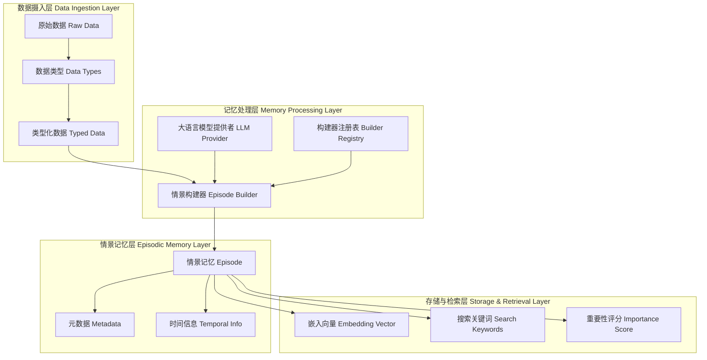
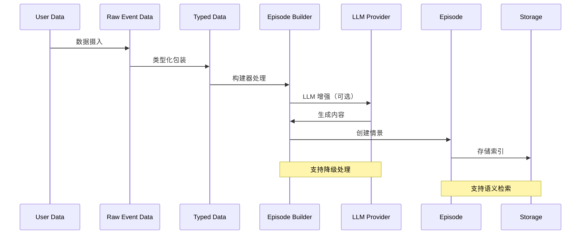

# Nemori 领域模型设计

## 项目愿景

Nemori 是一个自然启发的情景记忆系统，旨在赋予大语言模型类人的情景记忆能力。通过将原始用户数据转换为结构化的叙事情景，Nemori 实现了与人类记忆颗粒度对齐的智能记忆系统。

## 核心设计理念

### 情景记忆对齐理论

Nemori 的核心理念基于人类情景记忆的认知模式：

1. **颗粒度对齐**：与人类记忆回忆的颗粒度相匹配，确保 AI 能够以人类认知的方式组织和检索记忆
2. **分布对齐**：与大语言模型训练数据的文本分布保持一致，优化 token 预测概率
3. **语义解耦**：存储"人类尺度"的事件，提高检索中的信噪比

### 设计原则

- **自然性**：以事件为中心的记忆存储方式，符合人类认知习惯
- **连贯性**：情景片段具有完整的因果关系和时间表达能力
- **可检索性**：优化的索引和搜索机制，支持精准的记忆回溯
- **可扩展性**：支持多种数据源和记忆类型的统一处理

## 领域模型架构



## 核心概念模型

### 1. 数据抽象层

#### RawEventData（原始事件数据）
```python
@dataclass
class RawEventData:
    data_id: str                    # 数据唯一标识
    data_type: DataType            # 数据类型枚举
    content: Any                   # 原始内容
    source: str                    # 数据来源
    temporal_info: TemporalInfo    # 时间信息
    metadata: dict[str, Any]       # 灵活元数据
    processed: bool                # 处理状态
    processing_version: str        # 处理版本
```

**设计理念**：
- 统一的数据接口，支持多种数据源
- 灵活的元数据结构，适应不同数据类型的特殊需求
- 处理状态跟踪，支持增量处理和版本管理

#### DataType（数据类型枚举）
```python
class DataType(Enum):
    CONVERSATION = "conversation"    # 对话数据
    ACTIVITY = "activity"           # 活动数据
    LOCATION = "location"           # 位置数据
    MEDIA = "media"                 # 媒体数据
    DOCUMENT = "document"           # 文档数据
    SENSOR = "sensor"               # 传感器数据
    EXTERNAL = "external"           # 外部数据
    CUSTOM = "custom"               # 自定义数据
```

**设计理念**：
- 可扩展的数据类型系统
- 支持未来数据源的无缝集成
- 类型安全的数据处理流程

#### TypedEventData（类型化事件数据）
- 为不同数据类型提供专门的验证和处理逻辑
- 保持统一接口的同时支持类型特定的功能
- 示例：`ConversationData` 提供对话特定的消息解析和格式化

### 2. 情景记忆层

#### Episode（情景记忆）
```python
@dataclass
class Episode:
    episode_id: str                     # 情景唯一标识
    owner_id: str                       # 所有者标识
    episode_type: EpisodeType           # 情景类型
    level: EpisodeLevel                 # 情景层次
    title: str                          # 情景标题
    content: str                        # 情景内容
    summary: str                        # 情景摘要
    temporal_info: TemporalInfo         # 时间信息
    metadata: EpisodeMetadata           # 情景元数据
    structured_data: dict[str, Any]     # 结构化数据
    search_keywords: list[str]          # 搜索关键词
    embedding_vector: list[float]       # 嵌入向量
    recall_count: int                   # 回忆次数
    importance_score: float             # 重要性评分
    last_accessed: datetime             # 最后访问时间
```

**设计理念**：
- 完整的情景记忆表示，包含所有必要的元信息
- 支持语义搜索和关键词搜索的双重检索机制
- 自适应重要性评估，支持记忆的动态优先级管理

#### EpisodeType（情景类型）
```python
class EpisodeType(Enum):
    CONVERSATIONAL = "conversational"      # 对话型情景
    BEHAVIORAL = "behavioral"              # 行为型情景
    SPATIAL = "spatial"                    # 空间型情景
    CREATIVE = "creative"                  # 创作型情景
    PHYSIOLOGICAL = "physiological"        # 生理型情景
    SOCIAL = "social"                      # 社交型情景
    MIXED = "mixed"                        # 混合型情景
    SYNTHETIC = "synthetic"                # 合成型情景
```

#### EpisodeLevel（情景层次）
```python
class EpisodeLevel(Enum):
    ATOMIC = 1      # 原子级：单个事件/交互
    COMPOUND = 2    # 复合级：多个相关事件
    THEMATIC = 3    # 主题级：基于模式的高级洞察
    ARCHIVAL = 4    # 档案级：长期合成理解
```

**设计理念**：
- 层次化的记忆组织结构
- 支持从细粒度到宏观的不同抽象层次
- 为未来的记忆聚合和合成提供基础

### 3. 处理引擎层

#### EpisodeBuilder（情景构建器）
```python
class EpisodeBuilder(ABC):
    supported_data_type: DataType       # 支持的数据类型
    default_episode_type: EpisodeType   # 默认情景类型
    llm_provider: LLMProvider          # 大语言模型提供者
    
    def build_episode(self, data: RawEventData, for_owner: str) -> Episode:
        # 核心构建流程
        pass
```

**核心流程**：
1. **数据预处理**：将原始数据转换为类型化数据
2. **内容提取**：生成标题、内容和摘要
3. **元数据生成**：提取实体、主题、情感等元信息
4. **结构化数据提取**：保存类型特定的结构化信息
5. **情景层次判断**：确定情景的抽象层次
6. **关键词生成**：生成搜索优化的关键词
7. **后处理**：最终的情景优化和验证

#### ConversationEpisodeBuilder（对话情景构建器）
专门处理对话数据的构建器，具有以下特点：

- **智能边界检测**：使用 LLM 分析对话流，自动识别情景边界
- **叙事生成**：将对话格式转换为第三人称叙事描述
- **时间解析**：处理相对时间引用，转换为绝对时间
- **降级处理**：在 LLM 不可用时提供基础功能

### 4. 支撑服务层

#### LLMProvider（大语言模型提供者）
```python
class LLMProvider(Protocol):
    def generate(self, prompt: str, temperature: float = None) -> str:
        """生成文本响应"""
        pass
    
    def test_connection(self) -> bool:
        """测试连接状态"""
        pass
```

**设计理念**：
- 协议化的接口设计，支持多种 LLM 提供者
- 统一的 API 抽象，隔离具体实现细节
- 支持可选的 LLM 集成，系统可在无 LLM 情况下运行

#### EpisodeBuilderRegistry（构建器注册表）
- 管理不同数据类型的构建器
- 支持动态注册和发现
- 提供统一的构建入口点

## 数据流转模型



## 记忆检索模型

### 检索策略

1. **关键词匹配**：基于生成的搜索关键词进行快速匹配
2. **语义相似性**：利用嵌入向量进行语义搜索
3. **时间过滤**：基于时间信息的过滤和排序
4. **重要性加权**：结合访问频率和重要性评分

### 记忆更新机制

- **访问追踪**：记录每次记忆访问，更新访问计数和时间
- **重要性调整**：基于访问模式动态调整重要性评分
- **关联建立**：支持情景间的关联关系建立

## 扩展性设计

### 新数据类型支持

1. 定义新的 `DataType` 枚举值
2. 实现对应的 `TypedEventData` 子类
3. 创建专门的 `EpisodeBuilder` 实现
4. 在注册表中注册新的构建器

### 新的情景层次

支持在现有四层基础上扩展新的抽象层次，满足不同应用场景的需求。

### 多模态记忆

当前架构支持未来扩展到多模态记忆，包括：
- 图像情景记忆
- 音频情景记忆
- 视频情景记忆
- 传感器数据情景记忆

## 质量保证

### 数据完整性

- 不可变数据结构保证数据一致性
- 全面的验证机制确保数据质量
- 序列化/反序列化的往返一致性

### 错误处理

- 优雅的降级机制
- 详细的错误日志记录
- 弹性的处理流程设计

### 性能优化

- 批量处理支持
- 内存效率的数据结构
- 可扩展的索引机制

## 总结

Nemori 的领域模型设计体现了对人类情景记忆认知模式的深度理解和技术实现。通过分层的架构设计、灵活的数据处理流程和智能的记忆生成机制，Nemori 为大语言模型提供了一个强大的情景记忆系统。

这个系统不仅在技术上实现了与人类记忆颗粒度的对齐，更在设计理念上体现了对未来 AI 记忆机制的前瞻性思考。通过持续的迭代和优化，Nemori 将继续向着更加智能、自然的 AI 记忆系统目标前进。