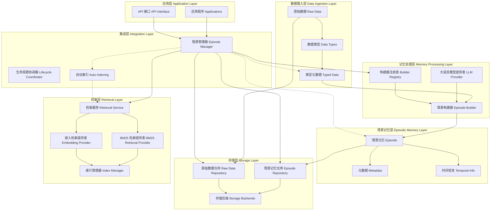
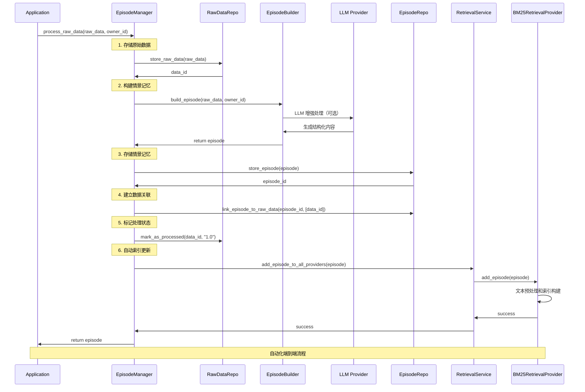
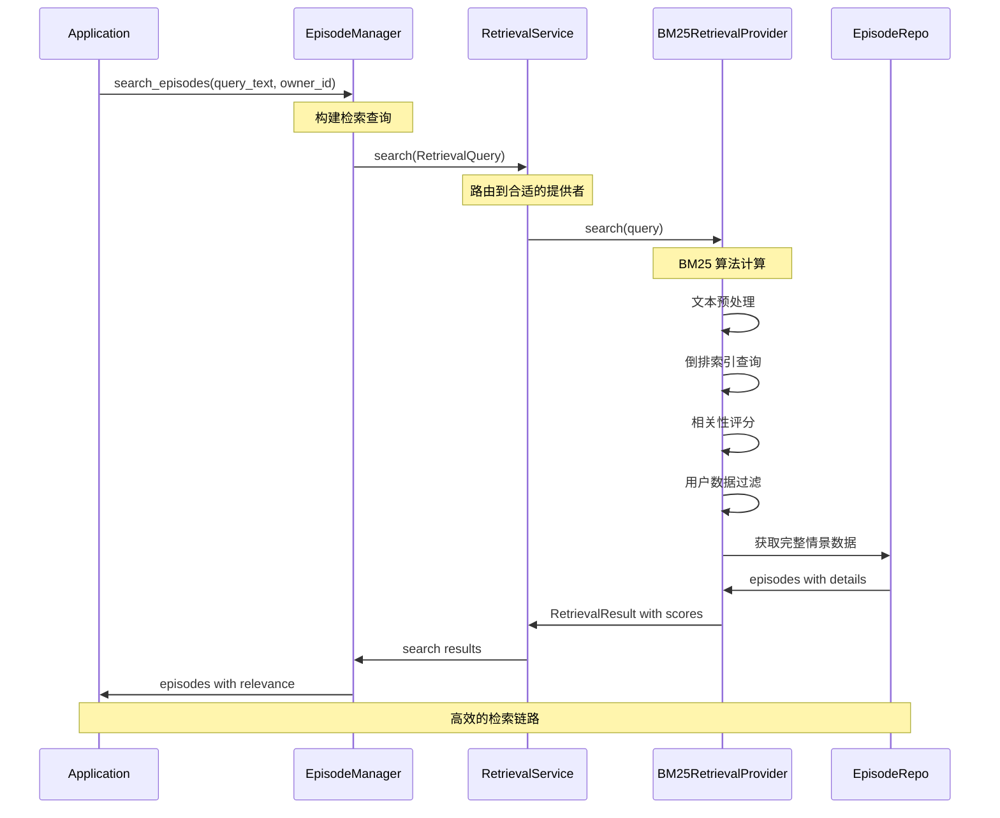
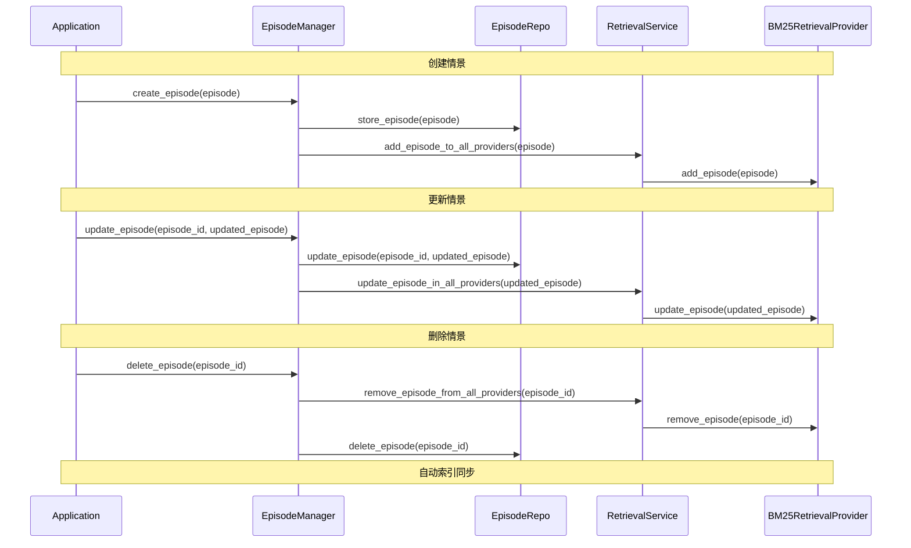

# Nemori 领域模型设计

## 项目愿景

Nemori 是一个自然启发的情景记忆系统，旨在赋予大语言模型类人的情景记忆能力。通过将原始用户数据转换为结构化的叙事情景，Nemori 实现了与人类记忆颗粒度对齐的智能记忆系统。

## 核心设计理念

### 情景记忆对齐理论

Nemori 的核心理念基于人类情景记忆的认知模式：

1. **颗粒度对齐**：与人类记忆回忆的颗粒度相匹配，确保 AI 能够以人类认知的方式组织和检索记忆
2. **分布对齐**：与大语言模型训练数据的文本分布保持一致，优化 token 预测概率
3. **语义解耦**：存储"人类尺度"的事件，提高检索中的信噪比

### 设计原则

- **自然性**：以事件为中心的记忆存储方式，符合人类认知习惯
- **连贯性**：情景片段具有完整的因果关系和时间表达能力
- **可检索性**：优化的索引和搜索机制，支持精准的记忆回溯
- **可扩展性**：支持多种数据源和记忆类型的统一处理

## 领域模型架构



## 核心概念模型

### 1. 数据抽象层

#### RawEventData（原始事件数据）
```python
@dataclass
class RawEventData:
    data_id: str                    # 数据唯一标识
    data_type: DataType            # 数据类型枚举
    content: Any                   # 原始内容
    source: str                    # 数据来源
    temporal_info: TemporalInfo    # 时间信息
    metadata: dict[str, Any]       # 灵活元数据
    processed: bool                # 处理状态
    processing_version: str        # 处理版本
```

**设计理念**：
- 统一的数据接口，支持多种数据源
- 灵活的元数据结构，适应不同数据类型的特殊需求
- 处理状态跟踪，支持增量处理和版本管理

#### DataType（数据类型枚举）
```python
class DataType(Enum):
    CONVERSATION = "conversation"    # 对话数据
    ACTIVITY = "activity"           # 活动数据
    LOCATION = "location"           # 位置数据
    MEDIA = "media"                 # 媒体数据
    DOCUMENT = "document"           # 文档数据
    SENSOR = "sensor"               # 传感器数据
    EXTERNAL = "external"           # 外部数据
    CUSTOM = "custom"               # 自定义数据
```

**设计理念**：
- 可扩展的数据类型系统
- 支持未来数据源的无缝集成
- 类型安全的数据处理流程

#### TypedEventData（类型化事件数据）
- 为不同数据类型提供专门的验证和处理逻辑
- 保持统一接口的同时支持类型特定的功能
- 示例：`ConversationData` 提供对话特定的消息解析和格式化

### 2. 情景记忆层

#### Episode（情景记忆）
```python
@dataclass
class Episode:
    episode_id: str                     # 情景唯一标识
    owner_id: str                       # 所有者标识
    episode_type: EpisodeType           # 情景类型
    level: EpisodeLevel                 # 情景层次
    title: str                          # 情景标题
    content: str                        # 情景内容
    summary: str                        # 情景摘要
    temporal_info: TemporalInfo         # 时间信息
    metadata: EpisodeMetadata           # 情景元数据
    structured_data: dict[str, Any]     # 结构化数据
    search_keywords: list[str]          # 搜索关键词
    embedding_vector: list[float]       # 嵌入向量
    recall_count: int                   # 回忆次数
    importance_score: float             # 重要性评分
    last_accessed: datetime             # 最后访问时间
```

**设计理念**：
- 完整的情景记忆表示，包含所有必要的元信息
- 支持语义搜索和关键词搜索的双重检索机制
- 自适应重要性评估，支持记忆的动态优先级管理

#### EpisodeType（情景类型）
```python
class EpisodeType(Enum):
    CONVERSATIONAL = "conversational"      # 对话型情景
    BEHAVIORAL = "behavioral"              # 行为型情景
    SPATIAL = "spatial"                    # 空间型情景
    CREATIVE = "creative"                  # 创作型情景
    PHYSIOLOGICAL = "physiological"        # 生理型情景
    SOCIAL = "social"                      # 社交型情景
    MIXED = "mixed"                        # 混合型情景
    SYNTHETIC = "synthetic"                # 合成型情景
```

#### EpisodeLevel（情景层次）
```python
class EpisodeLevel(Enum):
    ATOMIC = 1      # 原子级：单个事件/交互
    COMPOUND = 2    # 复合级：多个相关事件
    THEMATIC = 3    # 主题级：基于模式的高级洞察
    ARCHIVAL = 4    # 档案级：长期合成理解
```

**设计理念**：
- 层次化的记忆组织结构
- 支持从细粒度到宏观的不同抽象层次
- 为未来的记忆聚合和合成提供基础

### 3. 处理引擎层

#### EpisodeBuilder（情景构建器）
```python
class EpisodeBuilder(ABC):
    supported_data_type: DataType       # 支持的数据类型
    default_episode_type: EpisodeType   # 默认情景类型
    llm_provider: LLMProvider          # 大语言模型提供者
    
    def build_episode(self, data: RawEventData, for_owner: str) -> Episode:
        # 核心构建流程
        pass
```

**核心流程**：
1. **数据预处理**：将原始数据转换为类型化数据
2. **内容提取**：生成标题、内容和摘要
3. **元数据生成**：提取实体、主题、情感等元信息
4. **结构化数据提取**：保存类型特定的结构化信息
5. **情景层次判断**：确定情景的抽象层次
6. **关键词生成**：生成搜索优化的关键词
7. **后处理**：最终的情景优化和验证

#### ConversationEpisodeBuilder（对话情景构建器）
专门处理对话数据的构建器，具有以下特点：

- **智能边界检测**：使用 LLM 分析对话流，自动识别情景边界
- **叙事生成**：将对话格式转换为第三人称叙事描述
- **时间解析**：处理相对时间引用，转换为绝对时间
- **降级处理**：在 LLM 不可用时提供基础功能

### 4. 集成协调层

#### EpisodeManager（情景管理器）
```python
class EpisodeManager:
    raw_data_repo: RawDataRepository       # 原始数据仓库
    episode_repo: EpisodicMemoryRepository # 情景记忆仓库
    builder_registry: EpisodeBuilderRegistry # 构建器注册表
    retrieval_service: RetrievalService    # 检索服务
    
    async def process_raw_data(self, data: RawEventData, owner_id: str) -> Episode:
        # 完整的数据处理流程
        pass
```

**核心职责**：
1. **生命周期协调**：管理情景记忆从创建到删除的完整流程
2. **自动索引管理**：透明的检索索引同步和维护
3. **跨层数据流**：协调构建层、存储层、检索层的数据交互
4. **用户隔离**：严格的多用户数据安全保证
5. **错误处理**：提供健壮的错误处理和恢复机制
6. **系统监控**：统一的健康检查和性能监控

**关键特性**：
- 单一入口：所有情景记忆操作的统一接口
- 自动化：透明的索引维护，无需手动管理
- 一致性：确保跨层数据的一致性和完整性
- 可靠性：组件故障不影响整体系统稳定性

### 5. 检索服务层

#### RetrievalService（检索服务）
```python
class RetrievalService:
    episode_repo: EpisodicMemoryRepository     # 数据源仓库
    providers: dict[RetrievalStrategy, RetrievalProvider] # 检索策略提供者
    
    async def search(self, query: RetrievalQuery) -> RetrievalResult:
        # 统一的检索接口
        pass
    
    def register_provider(self, strategy: RetrievalStrategy, config: RetrievalConfig):
        # 注册检索策略
        pass
```

**设计理念**：
- **策略可插拔**：支持多种检索算法的动态配置
- **用户隔离**：每个用户独立的检索索引空间
- **性能优化**：高效的索引结构和查询算法
- **可扩展性**：支持新检索策略的无缝集成

#### RetrievalProvider（检索提供者）
```python
class RetrievalProvider(ABC):
    @abstractmethod
    async def add_episode(self, episode: Episode) -> None:
        """添加情景到索引"""
        pass
    
    @abstractmethod
    async def search(self, query: RetrievalQuery) -> RetrievalResult:
        """执行检索查询"""
        pass
    
    @abstractmethod
    async def remove_episode(self, episode_id: str) -> None:
        """从索引移除情景"""
        pass
```

**已实现策略**：
- **BM25RetrievalProvider**：基于 BM25 算法的文本检索
  - NLTK 专业文本预处理
  - 多字段权重评分（标题、摘要、实体、主题、内容）
  - 降级评分机制保证查询鲁棒性
  - 用户独立索引管理

**规划策略**：
- **EmbeddingProvider**：基于向量嵌入的语义检索
- **KeywordProvider**：关键词精确匹配检索
- **HybridProvider**：多策略融合检索

### 6. 支撑服务层

#### LLMProvider（大语言模型提供者）
```python
class LLMProvider(Protocol):
    def generate(self, prompt: str, temperature: float = None) -> str:
        """生成文本响应"""
        pass
    
    def test_connection(self) -> bool:
        """测试连接状态"""
        pass
```

**设计理念**：
- 协议化的接口设计，支持多种 LLM 提供者
- 统一的 API 抽象，隔离具体实现细节
- 支持可选的 LLM 集成，系统可在无 LLM 情况下运行

#### EpisodeBuilderRegistry（构建器注册表）
- 管理不同数据类型的构建器
- 支持动态注册和发现
- 提供统一的构建入口点

## 数据流转模型

### 完整数据处理流程



### 检索查询流程



### 情景生命周期管理



## 记忆检索模型

### 检索架构设计

#### 分层检索系统
```
应用层查询 → EpisodeManager → RetrievalService → 具体提供者 → 索引引擎
```

#### 检索策略体系
```python
class RetrievalStrategy(Enum):
    BM25 = "bm25"           # 基于 BM25 的文本相关性检索
    EMBEDDING = "embedding"  # 基于向量嵌入的语义检索
    KEYWORD = "keyword"      # 基于关键词的精确匹配
    HYBRID = "hybrid"        # 多策略融合检索
```

### BM25 检索实现

#### 算法特性
- **TF-IDF 权重**：词频-逆文档频率统计
- **文档长度归一化**：消除文档长度偏差
- **多字段权重评分**：标题、摘要、实体、主题、内容的差异化权重
- **用户数据隔离**：每用户独立索引空间

#### 文本预处理流程
1. **NLTK 分词**：专业级英文分词处理
2. **停用词过滤**：移除高频低信息量词汇
3. **词干提取**：Porter Stemmer 统一词形变化
4. **倒排索引构建**：词项到文档的高效映射

#### 相关性评分算法
```
BM25(q,d) = Σ IDF(qi) × (f(qi,d) × (k1 + 1)) / (f(qi,d) + k1 × (1 - b + b × |d|/avgdl))

多字段加权：
final_score = (title_score × 3.0 + summary_score × 2.0 + 
               entity_score × 2.0 + topic_score × 2.0 + 
               content_score × 1.0) / total_weight
```

### 高级检索功能

#### 多条件组合查询
```python
query = RetrievalQuery(
    text="机器学习项目",           # 文本查询
    owner_id="user123",          # 用户隔离
    episode_types=[EpisodeType.CONVERSATIONAL],  # 类型过滤
    time_range_hours=48,         # 时间范围
    min_importance=0.5,          # 重要性阈值
    limit=20                     # 结果数量
)
```

#### 智能查询路由
- **策略选择**：根据查询类型自动选择最优检索策略
- **结果融合**：多策略结果的智能合并和排序
- **降级处理**：主策略失败时的备用方案

### 索引管理机制

#### 自动索引生命周期
- **创建时索引**：新情景立即加入检索索引
- **更新时重索引**：保持索引与数据的实时同步
- **删除时清理**：避免索引中的孤儿数据
- **批量重建**：支持从存量数据完整重建索引

#### 增量更新策略
- **实时同步**：情景变更立即反映到索引
- **批量优化**：定期批量操作提高性能
- **版本控制**：索引版本管理和回滚能力

### 记忆访问和更新机制

#### 智能访问追踪
```python
# 获取情景并追踪访问
episode = await manager.get_episode(episode_id, mark_accessed=True)

# 自动更新：
# - recall_count 递增
# - last_accessed 时间戳更新
# - 存储层同步记录
```

#### 重要性动态调整
- **访问频率权重**：高频访问的情景提升重要性
- **时间衰减因子**：旧情景重要性自然衰减
- **用户行为学习**：基于用户检索模式优化评分

#### 关联关系发现
- **语义关联**：基于内容相似性的自动关联
- **时间关联**：时间相近情景的关联建立
- **主题关联**：相同主题情景的聚类组织

## 扩展性设计

### 新数据类型支持

1. 定义新的 `DataType` 枚举值
2. 实现对应的 `TypedEventData` 子类
3. 创建专门的 `EpisodeBuilder` 实现
4. 在注册表中注册新的构建器

### 新的情景层次

支持在现有四层基础上扩展新的抽象层次，满足不同应用场景的需求。

### 多模态记忆

当前架构支持未来扩展到多模态记忆，包括：
- 图像情景记忆
- 音频情景记忆
- 视频情景记忆
- 传感器数据情景记忆

## 质量保证

### 数据完整性

- 不可变数据结构保证数据一致性
- 全面的验证机制确保数据质量
- 序列化/反序列化的往返一致性

### 错误处理

- 优雅的降级机制
- 详细的错误日志记录
- 弹性的处理流程设计

### 性能优化

- 批量处理支持
- 内存效率的数据结构
- 可扩展的索引机制

## 系统架构总览

### 完整技术栈

```
┌─────────────────────────────────────────────┐
│               应用层                         │
│  - 业务逻辑                                  │
│  - API 接口                                 │
│  - 用户交互                                  │
├─────────────────────────────────────────────┤
│               集成层                         │
│  - EpisodeManager (核心协调器)              │
│  - 生命周期管理                              │
│  - 自动化数据流                              │
│  - 用户隔离和权限控制                        │
├─────────────────────────────────────────────┤
│  构建层    │    存储层    │    检索层        │
│ ─────────  │  ─────────  │  ─────────      │
│ Builders   │   Storage   │  Retrieval      │
│ ·Registry  │  ·RawData   │  ·Service       │
│ ·Conv.     │  ·Episodes  │  ·BM25          │
│ ·LLM       │  ·Memory    │  ·Embedding     │
│ ·Custom    │  ·DuckDB    │  ·Keyword       │
│            │  ·Custom    │  ·Hybrid        │
└─────────────────────────────────────────────┘
```

### 核心设计成就

#### 1. 架构完整性
- **六层架构**：从应用层到存储层的完整技术栈
- **职责分离**：每层专注核心功能，界限清晰
- **松耦合**：层间通过接口交互，支持独立演进
- **高内聚**：层内组件紧密协作，功能完整

#### 2. 自动化集成
- **端到端流程**：从原始数据到可检索情景的全自动处理
- **透明索引**：检索索引的自动维护和同步
- **生命周期管理**：情景创建、更新、删除的一体化管理
- **错误恢复**：组件故障的自动检测和恢复

#### 3. 可扩展架构
- **策略模式**：检索算法的可插拔设计
- **工厂模式**：构建器的动态注册和发现
- **仓库模式**：存储后端的抽象和实现分离
- **观察者模式**：事件驱动的跨层通信

#### 4. 性能优化
- **分层缓存**：多级缓存提升访问性能
- **增量更新**：避免全量重建的增量同步
- **批量处理**：提高大数据量处理效率
- **索引优化**：高效的倒排索引和相关性算法

#### 5. 数据安全
- **用户隔离**：严格的多用户数据分离
- **访问控制**：基于所有权的权限验证
- **数据完整性**：跨层数据一致性保证
- **隐私保护**：用户数据的安全存储和传输

### 技术创新点

#### 1. 情景记忆对齐
- **认知模型**：基于人类情景记忆的系统设计
- **颗粒度对齐**：与人类记忆回忆粒度的精确匹配
- **语义解耦**："人类尺度"事件的智能存储

#### 2. 智能检索算法
- **BM25 优化**：多字段权重的专业实现
- **降级机制**：保证查询鲁棒性的备用评分
- **用户隔离**：每用户独立索引空间

#### 3. 集成层设计
- **协调器模式**：统一的情景记忆生命周期管理
- **自动化流程**：透明的跨层数据同步
- **错误隔离**：组件故障不传播的设计

#### 4. 构建器生态
- **LLM 增强**：可选的大语言模型集成
- **降级处理**：无 LLM 环境下的基础功能
- **边界检测**：智能的情景边界识别

### 未来发展方向

#### 1. 多模态记忆
- 图像情景记忆处理
- 音频情景记忆分析  
- 视频情景记忆提取
- 传感器数据情景化

#### 2. 高级检索策略
- 深度学习嵌入检索
- 混合检索策略融合
- 个性化检索优化
- 实时检索结果推荐

#### 3. 分布式架构
- 微服务化部署
- 水平扩展支持
- 分布式索引管理
- 集群容错机制

#### 4. 智能化演进
- 自适应重要性学习
- 动态关联关系发现
- 用户行为模式识别
- 情景记忆自动合成

## 总结

Nemori 的领域模型设计代表了对人类情景记忆认知模式的深度理解和创新技术实现。通过七层架构的精心设计、完整的自动化数据流程和先进的检索算法，Nemori 为大语言模型提供了一个强大、智能、可扩展的情景记忆系统。

### 核心价值实现

✅ **认知对齐**：与人类记忆颗粒度的精确对齐  
✅ **自动化**：端到端的无人工干预数据流  
✅ **高性能**：工业级的检索算法和优化策略  
✅ **可扩展**：支持多种数据类型和检索策略  
✅ **安全性**：严格的用户数据隔离和权限控制  
✅ **可靠性**：健壮的错误处理和恢复机制  
✅ **易用性**：统一的 API 接口和简化的操作流程  

这个系统不仅在技术上实现了与人类记忆颗粒度的深度对齐，更在架构设计上体现了对未来 AI 记忆机制的前瞻性思考。Nemori 将继续引领情景记忆系统的技术发展，为构建更加智能、自然的 AI 记忆能力奠定坚实基础。

通过持续的技术创新和架构优化，Nemori 正在向着成为下一代 AI 系统标准记忆组件的目标稳步前进，为人工智能的记忆能力革命贡献核心技术力量。