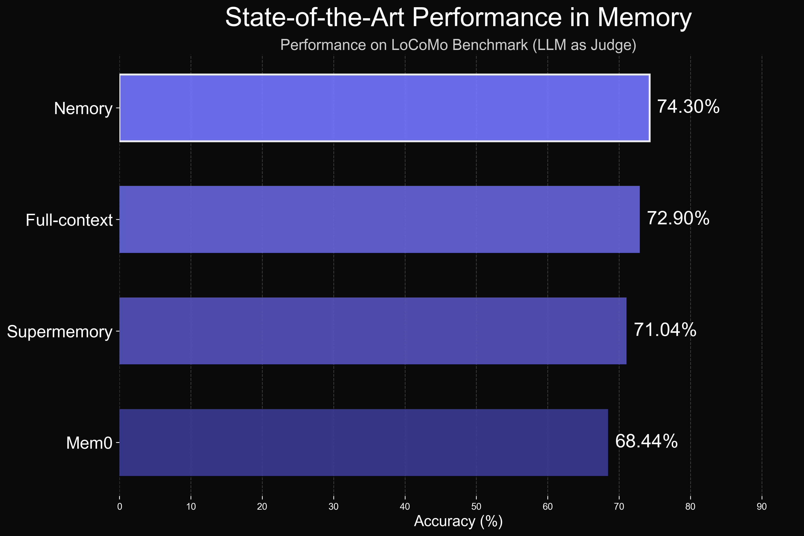
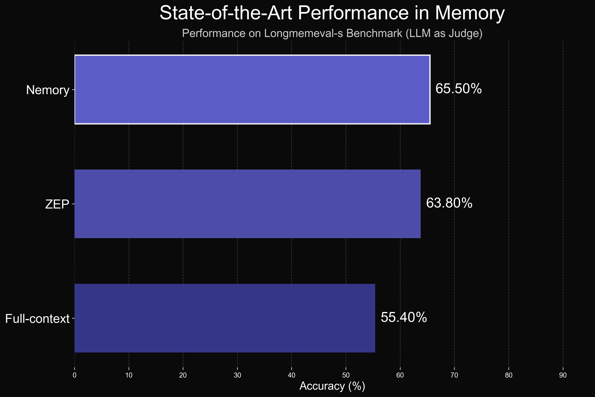

# Nemori：自然启发的 AI 情景记忆系统

*其他语言版本: [English](README.md)*

## 项目概述

Nemori-AI 旨在让 AI 具备类人的情景记忆能力。Nemori 通过自然、事件化的索引方式，帮助系统在关键时刻精准回溯原始经历。**愿景：**让每一次数据交互，都能像人类记忆一样被理解、被召回、被延续。

虽然 Mem0、Supermemory 和 ZEP 等先前系统在 AI 记忆方面做出了卓越尝试，在 LoCoMo 和 LongMemEval 等基准测试中取得了先进的性能，但 Nemori 引入了一种创新且简约的方法，专注于与人类情景记忆模式保持一致。

## 实验结果

为了突出 Nemori 的优越性，我们在 LoCoMo 和 LongMemEval 基准测试上进行了评估，与先前的最先进方法进行了比较：

### LoCoMo 基准测试结果

在 LoCoMo（长上下文对话建模）数据集上，Nemori 展现了卓越的性能：

### LongMemEval-s 基准测试结果

在 LongMemEval-s 数据集上，Nemori 同样取得了领先的性能：

## 设计理念

当我们人类回忆过去的事件时，我们的脑海中经常闪现相关的图像、动作或声音。我们的大脑通过让我们重新体验当时发生的事情来帮助我们记忆——这种记忆机制被称为情景记忆。

Nemori 的设计灵感来自人类的情景记忆。Nemori 可以自主地将人与人、人与 AI 智能体或 AI 智能体之间的对话重塑为情景片段。与原始对话相比，情景片段具有更连贯的因果关系和时间表达能力。更重要的是，情景片段的表达在某种程度上与我们人类记忆回忆的粒度相一致，这意味着作为人类，我们更可能提出关于情景片段的问题，这些问题在语义上更接近情景片段本身，而不是原始消息。

## 未来路线图

1. 仅仅拥有特定事件的情景记忆是不够的。我们希望通过相似性度量等方法聚合情景片段，形成更长期和通用的高级情景片段。

2. 我们从拟人化的角度设计了 Nemori。我们仍然不确定未来 AI 助手的记忆机制是否会与人类根本不同。我们将在这方面进行更深入的思考。

这个仓库仅代表我们工作的简化版本，但您可以参考评估文件夹中的文档来查看我们的基准测试分数。

**Nemori** - 赋予 AI 智能体长期记忆以驱动其自我进化 🚀 