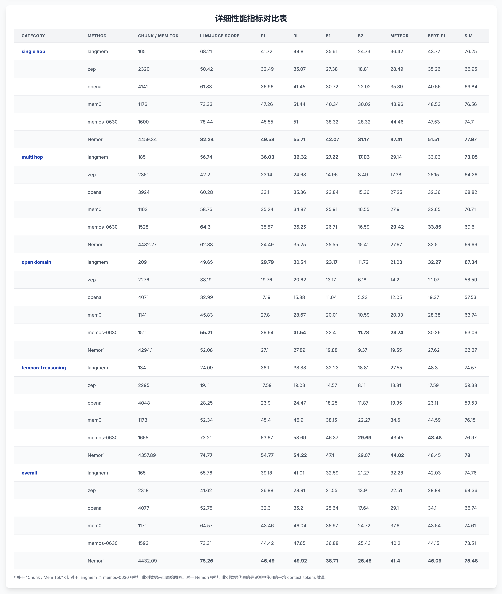

# Nemori: Nature-Inspired Episodic Memory

*Read this in other languages: [中文](README-zh.md)*

## Project Overview

Nemori-AI empowers large language models with human-like episodic memory.
Nemori stores experiences as natural, event-centric traces, enabling precise recall when it matters.
**Vision:** every piece of data remembered and retrieved as intuitively as human recollection.

Nemori is derived from our team's episodic memory indexing module within the memory system of our Tanka.ai project—an MVP implementation that we plan to open-source. Its core purpose is to share our approach to building memory indexing through Nature-Inspired Episodic Memory.

While previous systems like Mem0, Letta, Supermemory, ZEP, and MemOS have made remarkable attempts at AI memory, achieving advanced performance on the LoCoMo benchmark, Nemori introduces an innovative and minimalist approach centered on aligning with human episodic memory patterns. Given the recent surge of excellent open-source projects and research in memory systems, we've all converged on using the LoCoMo dataset as a benchmark. Consequently, we decided to participate in this benchmark with our MVP implementation that demonstrates our episodic memory indexing approach.

## Experimental Results

To highlight the superiority of Nemori's concise approach, we conducted evaluations on the LoCoMo benchmark, comparing against previous state-of-the-art approaches:

### LoCoMo Benchmark Results

On the LoCoMo (Long-Context Conversation Modeling) dataset, Nemori demonstrates exceptional performance:

## Reproduction Guide

To reproduce Nemori's experimental results on the LoCoMo benchmark, please refer to [evaluation/README.md](evaluation/README.md) for detailed evaluation environment setup and execution steps.

## Design Philosophy

When we humans recall past events, our minds often flash with related images, actions, or sounds. Our brains help us remember by essentially making us re-experience what happened at that time - this memory mechanism is called episodic memory.

Nemori's design inspiration comes from human episodic memory. Nemori can autonomously reshape conversations between humans, between humans and AI agents, or between AI agents into episodes. Compared to raw conversations, episodes have more coherent causal relationships and temporal expression capabilities. More importantly, the expression of episodes aligns to some extent with the granularity of our human memory recall, meaning that as humans, we are likely to ask questions about episodes that are semantically closer to the episodes themselves rather than the original messages.

### Granularity Alignment with LLM Training Distribution

A key insight in our design is that episodic memory granularity alignment offers potential optimization benefits for large language models. Since LLM training datasets align with the textual distribution of the human world, aligning recall granularity simultaneously aligns with the "most probable event description granularity in the natural world."

This alignment provides several advantages:
- **Reduced Distributional Shift**: When stored episodes match typical event spans found in training corpora, recall prompts resemble the pre-training distribution, improving token prediction probabilities
- **Enhanced Retrieval Precision**: Memory indices storing "human-scale" events operate on semantically less entangled units, increasing signal-to-noise ratio in retrieval

## Technical Implementation

### Data Preprocessing

Since our production system processes raw episodic data incrementally, we reused our topic segmentation strategy. This embodies the core philosophy of episodic memory creation: "aligning with the granularity of human memory event episodes." While our approach may appear inefficient and simplistic, this reflects the simplifications made for our MVP. In production, we employ more cost-effective and efficient methods.

For episode generation, we chose the most straightforward version that best illustrates our approach, using only gpt-4o-mini/gpt-4.1-mini for episodic memory extraction.

### Retrieval Strategy

We established a minimal BM25 index for each user's episodic memories. This might raise questions, but again, it's a simplification. Our production system employs a hybrid retrieval strategy combining sparse (BM25) and dense (vector retrieval) methods to balance recall and semantic matching capabilities, with different reranking strategies tailored to specific business needs.

With the preprocessing complete, the subsequent process is relatively straightforward. We retrieve the top 20 results, have gpt-4o-mini/gpt-4.1-mini generate responses, and follow an evaluation approach nearly identical to other projects.

## Future Roadmap

1. Having episodic memory of specific events alone is insufficient. We hope to aggregate episodes through similarity measures and other methods to form longer-term and more general high-level episodes.

2. We designed Nemori from an anthropomorphic perspective. We are still uncertain whether the memory mechanisms of future AI assistants will be fundamentally different from humans. We will engage in deeper thinking in this regard.

## Special Thanks

MemOS team—we forked their project and extended the evaluation framework to support Nemori benchmarking.

**Nemori** - Endowing AI agents with human-like episodic memory to drive their evolution 🚀

