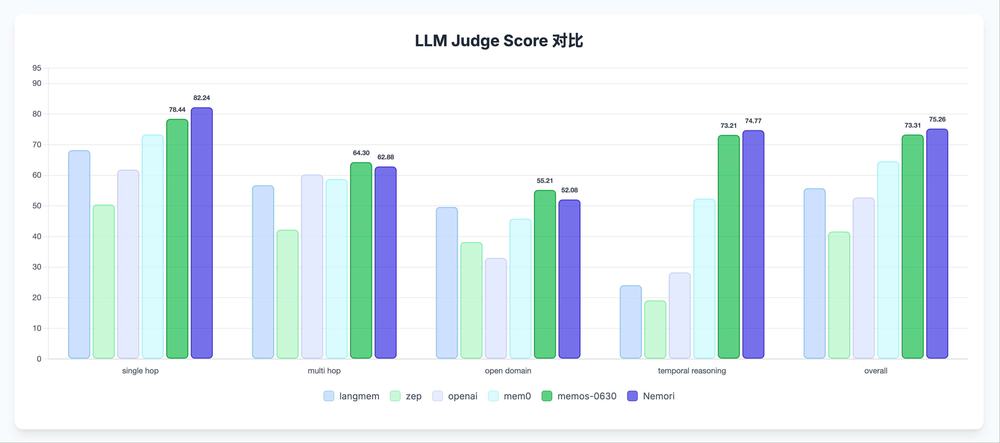

# Nemori: Self-Organizing Agent Memory Inspired by Cognitive Science

🌍 [English](README.md) | 🌍 [中文](README-CN.md) | **📄 [Paper](https://arxiv.org/abs/2508.03341)**

## Project Overview  

Nemori-AI empowers large language models with human-like episodic memory.

Nemori stores experiences as natural, event-centric traces, enabling precise recall when it matters.

**Vision:** Every piece of data remembered and retrieved as intuitively as human recollection.

Nemori is derived from our team's episodic memory indexing module within the memory system of our Tanka.ai project—an MVP implementation that we plan to open-source. Its core purpose is to share our approach to building memory indexing through Nature-Inspired Episodic Memory.

While previous systems like Mem0, Letta, Supermemory, ZEP, and MemOS have made remarkable attempts at AI memory, achieving advanced performance on the LoCoMo benchmark, Nemori introduces an innovative and minimalist approach centered on aligning with human episodic memory patterns. Given the recent surge of excellent open-source projects and research in memory systems, we've all converged on using the LoCoMo dataset as a benchmark. Consequently, we decided to participate in this benchmark with our MVP implementation that demonstrates our episodic memory indexing approach.

## Experimental Results

To highlight the superiority of Nemori's concise approach, we conducted evaluations on the LoCoMo benchmark, comparing against previous state-of-the-art approaches:

### LoCoMo Benchmark Results

On the LoCoMo (Long-Context Conversation Modeling) dataset, Nemori demonstrates exceptional performance:

## Reproduction Guide

To reproduce Nemori's experimental results on the LoCoMo benchmark, please refer to [evaluation/README.md](evaluation/README.md) for detailed evaluation environment setup and execution steps.

### Quick Pipeline Overview (2 Prompts + BM25 Retrieval)

> Reproducing the LoCoMo results with Nemori is very straightforward: the episodic construction uses only **2 short LLM prompts** (boundary detection & episode generation), then a simple **BM25** search retrieves memories and produces the final answer—no further LLM prompts required.

1. **Episode Boundary Detection — Prompt** `Detect episode boundaries along natural topic shifts`

2. **Episode Generation — Prompt** `Summarize each segment into an episodic memory`

3. **Build BM25 Index — No extra LLM calls, no embeddings required**

4. **Retrieval & Answer Generation — Pure BM25 (again, no additional LLM calls)**

## Design Philosophy

When we humans recall past events, our minds often flash with related images, actions, or sounds. Our brains help us remember by essentially making us re-experience what happened at that time - this memory mechanism is called episodic memory.

Nemori's design inspiration comes from human episodic memory. Nemori can autonomously reshape conversations between humans, between humans and AI agents, or between AI agents into episodes. Compared to raw conversations, episodes have more coherent causal relationships and temporal expression capabilities. More importantly, the expression of episodes aligns to some extent with the granularity of our human memory recall, meaning that as humans, we are likely to ask questions about episodes that are semantically closer to the episodes themselves rather than the original messages.

### Granularity Alignment with LLM Training Distribution

A key insight in our design is that episodic memory granularity alignment offers potential optimization benefits for large language models. Since LLM training datasets align with the textual distribution of the human world, aligning recall granularity simultaneously aligns with the "most probable event description granularity in the natural world."

This alignment provides several advantages:
- **Reduced Distributional Shift**: When stored episodes match typical event spans found in training corpora, recall prompts resemble the pre-training distribution, improving token prediction probabilities
- **Enhanced Retrieval Precision**: Memory indices storing "human-scale" events operate on semantically less entangled units, increasing signal-to-noise ratio in retrieval

## Technical Implementation

### Data Preprocessing

Since our production system processes raw episodic data incrementally, we reused our topic segmentation strategy. This embodies the core philosophy of episodic memory creation: "aligning with the granularity of human memory event episodes." While our approach may appear inefficient and simplistic, this reflects the simplifications made for our MVP. In production, we employ more cost-effective and efficient methods.

For episode generation, we chose the most straightforward version that best illustrates our approach, using only gpt-4o-mini/gpt-4.1-mini for episodic memory extraction.

### Retrieval Strategy

We established a minimal BM25 index for each user's episodic memories. This might raise questions, but again, it's a simplification. Our production system employs a hybrid retrieval strategy combining sparse (BM25) and dense (vector retrieval) methods to balance recall and semantic matching capabilities, with different reranking strategies tailored to specific business needs.

With the preprocessing complete, the subsequent process is relatively straightforward. We retrieve the top 20 results, have gpt-4o-mini/gpt-4.1-mini generate responses, and follow an evaluation approach nearly identical to other projects.

## Future Roadmap

1. [Planned open source] Add "semantic memory" capability to address the issue of episodic memory losing information such as names and locations from the original text.

2. Having episodic memory of specific events alone is insufficient. We hope to aggregate episodes through similarity measures and other methods to form longer-term and more general high-level episodes.

## FAQ

### 1. Q: Nemori's score on the LoCoMo dataset doesn't seem much higher than MemOS. What are the significant advantages of your memory approach?

MemOS is an excellent solution, and in our real-world systems, we have many similar module designs. In practical scenarios, memory is still a business-specific problem, so we do not intend to compare the merits of the frameworks themselves. What we want to express is that starting from the simple yet profound insight of "aligning with the granularity of human memory events," **for certain types of tasks**, even simple methods can rival complex memory frameworks. In this version, we didn't even use embeddings to enhance semantic recall. Therefore, if you just want to improve the score on this dataset, there is still a lot of room for improvement. You are welcome to try common optimization strategies, such as boundary context repair after episode segmentation, strategically including parts of the original text, introducing hybrid retrieval + rerank, or memory association fusion. These are all methods we use and have proven effective in real systems.

### 2. Q: Why do you only use episodes after retrieval, without including the original text?

In our real system, we have another solution (planned to be open-sourced) to address the issue that "some information can only be obtained from the original text." The general approach is to selectively fuse key semantic memories back into episodic memory, which we have omitted here for simplicity. We also don't think that directly including all or the top-x original texts would bring significant improvement. Intuitively, it may help in some cases, but overall, the change won't be substantial (mainly limited by gpt-4o-mini). Feel free to try it out if you're interested.

### 3. Q: In Nemori's experimental data, each question consumes significantly more tokens than other methods. Is this effect achieved by using a large amount of context?

The construction strategy of episodic memory makes episode descriptions longer than typical summary statements. With the same topk = 20, the total token count is much higher than other methods, but in our experience, even with topk = 10 (i.e., about half the tokens), the performance difference may not be significant. Conversely, if increasing the context window within a reasonable range improves performance, why not do it?

### 4. Q: In your method, there are many expressions like "the previous Friday (June 23, 2023)" in the episodes. Is this a targeted optimization for the evaluation set?

In our team's real Agent system, there is a dedicated time enhancement process, and the results are attached to the episode metadata to help accurately locate relative/absolute time in different business scenarios. In the MVP, we simplified this by directly concatenating such expressions in the episode text. If this operation helps with the LoCoMo dataset (I'm not entirely sure, as this is how we did it in the first version), it means the dataset's construction is quite close to our real business scenarios, which is very much in line with expectations.

### 5. Q: There are many elements in the code, such as EpisodeLevel and Time Gap calculation, that don't seem to be used. Why design these in an MVP project?

50% are features not carefully stripped out during production project migration, and 50% are Claude Code's creative freedom.

### 6. Q: Has the episodic memory method proven effective in other scenarios?

Our intention is to design a more efficient "memory indexing method" for two scenarios: "AI Agent as a user's social/office assistant" and "general ChatBot." So although we haven't done many experiments, it can be basically inferred that using this method for document or knowledge base memory scenarios is unlikely to bring direct improvements.

## Special Thanks

MemOS team—we forked their project and extended the evaluation framework to support Nemori benchmarking.

## License

This project is licensed under the MIT License - see the [LICENSE](LICENSE) file for details.

**Nemori** - Endowing AI agents with human-like episodic memory to drive their evolution 🚀