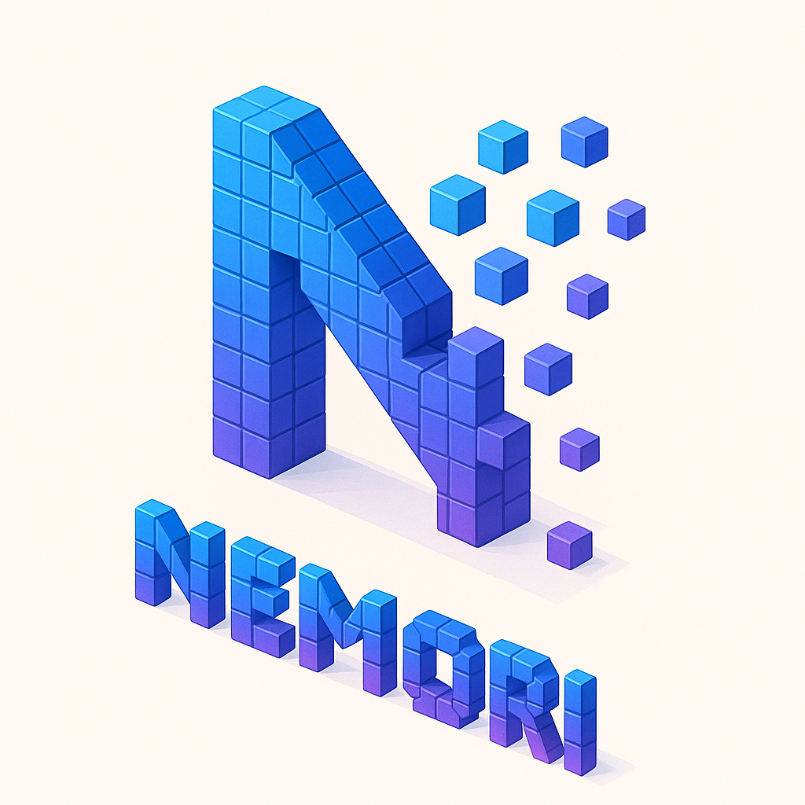
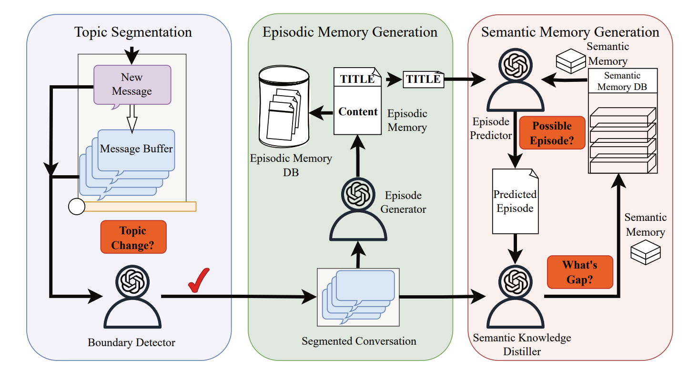
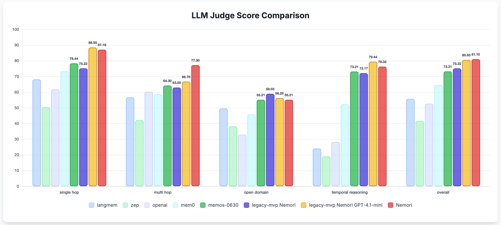

# Nemori Memory System

**📄 [Paper](https://arxiv.org/abs/2508.03341)**

> Important: This release is a complete rewrite aligned with the paper and is not compatible with the previous MVP. The legacy MVP is available here: [legacy-mvp branch](https://github.com/nemori-ai/nemori/tree/legacy-mvp)



Nemori is a self-organising long-term memory substrate for agentic LLM workflows. It ingests multi-turn conversations, segments them into topic-consistent episodes, distils durable semantic knowledge, and exposes a unified search surface for downstream reasoning. The implementation combines insights from Event Segmentation Theory and Predictive Processing with production-ready concurrency, caching, and pluggable storage.

<br clear="left">

- **🐍 Language:** Python 3.10+
- **📜 License:** MIT
- **📦 Key dependencies:** asyncpg, Qdrant, OpenAI SDK, Pillow

---

## 1. ❓ Why Nemori

Large language models rapidly forget long-horizon context. Nemori counters this with two coupled control loops:

1. **🔄 Two-Step Alignment**
   - *🎯 Boundary Alignment* – LLM-powered boundary detection with transitional masking heuristics keeps episodes semantically coherent.
   - *📝 Representation Alignment* – the episode generator converts each segment into rich narratives with precise temporal anchors and provenance.
2. **🔮 Predict–Calibrate Learning**
   - *💭 Predict* – hypothesise new episodes from existing semantic knowledge to surface gaps early.
   - *🎯 Calibrate* – extract high-value facts from discrepancies and fold them into the semantic knowledge base.

The result is a compact, queryable memory fabric that stays faithful to the source dialogue while remaining efficient to traverse.

---

## 2. 🚀 Quick Start

### 2.1 🐳 Infrastructure (Docker Compose)

Nemori uses PostgreSQL for metadata and text search, and Qdrant for vector storage. Start both with a single command:

```bash
docker compose up -d
```

This launches PostgreSQL 16 (port 5432) and Qdrant (ports 6333/6334) with persistent volumes.

### 2.2 📥 Install Nemori

Using [uv](https://github.com/astral-sh/uv) is the easiest way to manage the environment:

```bash
brew install uv                # or curl -LsSf https://astral.sh/uv/install.sh | sh

git clone https://github.com/nemori-ai/nemori.git
cd nemori

uv venv
source .venv/bin/activate      # Windows: .venv\Scripts\activate

uv sync
```

Alternatively, install in editable mode:

```bash
pip install -e .
```

### 2.3 🔑 Credentials

Create a `.env` file in the repo root:

```bash
# OpenRouter (recommended — single key for both LLM and embeddings)
LLM_API_KEY=sk-or-...
LLM_BASE_URL=https://openrouter.ai/api/v1
EMBEDDING_API_KEY=sk-or-...
EMBEDDING_BASE_URL=https://openrouter.ai/api/v1

# Or use direct OpenAI
# LLM_API_KEY=sk-...
# EMBEDDING_API_KEY=sk-...
```

Nemori only reads these variables; it never writes secrets to disk. 🔒

### 2.4 💡 Minimal usage

```python
import asyncio
from nemori import NemoriMemory, MemoryConfig

async def main():
    # DSN, API keys, and base URLs are resolved from environment variables.
    # Only model names need to be specified explicitly.
    config = MemoryConfig(
        llm_model="openai/gpt-4.1-mini",
        embedding_model="google/gemini-embedding-001",
    )
    async with NemoriMemory(config) as memory:
        await memory.add_messages("user123", [
            {"role": "user", "content": "I started training for a marathon in Seattle."},
            {"role": "assistant", "content": "Great! When is the race?"},
            {"role": "user", "content": "It is in October."},
        ])
        await memory.flush("user123")
        results = await memory.search("user123", "marathon training")
        print(results)

asyncio.run(main())
```

---

## 3. 🏗️ System Architecture



Nemori uses a **dual-backend** storage architecture:
- **PostgreSQL** – metadata, text search (tsvector/GIN indexes), and message buffering.
- **Qdrant** – all vector storage and similarity search with automatic embedding dimension adaptation.

Both backends are fully async via `asyncpg` and the Qdrant gRPC client.

---

## 4. 📂 Repository Layout

```
nemori/
├── api/            # Async facade (NemoriMemory)
├── core/           # MemorySystem orchestrator
├── db/             # PostgreSQL stores + Qdrant vector store
├── domain/         # Models, interfaces, exceptions
├── llm/            # LLM client, orchestrator, generators
├── search/         # Unified search (vector + text + hybrid)
├── services/       # Embedding client, event bus
└── utils/          # Image compression utilities

evaluation/
├── locomo/         # LoCoMo benchmark scripts
├── longmemeval/    # Long-context evaluation suite
└── readme.md       # Dataset instructions

docker/
└── init-extensions.sql   # PostgreSQL extension setup
```

---

## 5. 📊 Running Evaluations

### 5.1 🔧 LoCoMo pipeline

```bash
PYTHONPATH=. python evaluation/locomo/add.py
PYTHONPATH=. python evaluation/locomo/search.py
PYTHONPATH=. python evaluation/locomo/evals.py
PYTHONPATH=. python evaluation/locomo/generate_scores.py
```

### 5.2 🏆 Latest LoCoMo scores (V5)


| Category | BLEU | F1 | LLM | Count |
|----------|------|----|-----|-------|
| Multi-Hop | 0.3432 | 0.4338 | 0.7943 | 282 |
| Temporal | 0.5109 | 0.5913 | 0.7882 | 321 |
| Open-Domain | 0.2224 | 0.2736 | 0.5938 | 96 |
| Single-Hop | 0.5046 | 0.5664 | 0.8859 | 841 |

✨ Overall LLM alignment: **0.8305**

### 5.3 📚 LongMemEval

See `evaluation/longmemeval/readme.md` for running the 100k-token context benchmark.

---

## 6. 🐳 Docker Deployment

Start the infrastructure services:

```bash
docker compose up -d
```

This brings up:
- **PostgreSQL 16** on port `5432` (user: `nemori`, password: `nemori`, db: `nemori`)
- **Qdrant** on ports `6333` (HTTP) and `6334` (gRPC)

Data is persisted in Docker volumes (`nemori_pg_data`, `nemori_qdrant_data`).

To stop:

```bash
docker compose down        # keep data
docker compose down -v     # remove data volumes
```

---

## 7. 🏢 Multi-Tenant Support

Nemori supports workspace isolation via `agent_id`. Each agent gets its own namespace for episodes, semantic memories, and vector collections, enabling safe multi-tenant deployments.

---

## 8. 🖼️ Multimodal Support

Nemori supports image inputs via `add_multimodal_message()`. Images are automatically compressed and stored alongside text content, enabling memory formation from visual conversations.

---

## 9. 🛠️ Developing with Nemori

- 🧪 Tests: `pytest tests/`
- 🔍 Linting: `ruff check nemori`
- 📝 Type checking: `mypy nemori`
- 📊 Benchmark helpers live in `scripts/`

Use the `NemoriMemory` facade for experiments and inject custom storage or LLM clients when integrating into larger systems.

---

## 10. 🔧 Troubleshooting

| 🚨 Symptom | 🔍 Likely cause | 💡 Mitigation |
|---------|--------------|------------|
| `asyncpg.ConnectionError` on startup | PostgreSQL not running | Run `docker compose up -d` and wait for healthcheck |
| Qdrant connection refused | Qdrant container not ready | Check `docker compose ps`; wait for healthy status |
| Embedding dimension mismatch | Model changed without recreating collection | Delete the Qdrant collection and re-ingest |

---

## 11. 🤝 Contributing

1. 🍴 Fork the repository and create a feature branch.
2. ✅ Add or update tests (`pytest`, `ruff`, `mypy`).
3. 🚀 Open a PR explaining architectural impact (boundary logic, storage schema, etc.).

Nemori is evolving toward multi-agent deployments. Feedback and collaboration are welcome! 💬

---
## 12. 📰 News
- **🎉 2026-03-24** — Complete async refactoring: PostgreSQL + Qdrant dual backend, OpenRouter LLM support, multimodal messages, Docker Compose deployment.
- **🎉 2025-10-28** — Upgraded the segmenter component and added token counting functionality for evaluation.
- **🎉 2025-09-26** — Released Nemori as fully open source, covering episodic and semantic memory implementations end-to-end.
- **🏁 2025-07-10** — Delivered the MVP of episodic memory generation.
