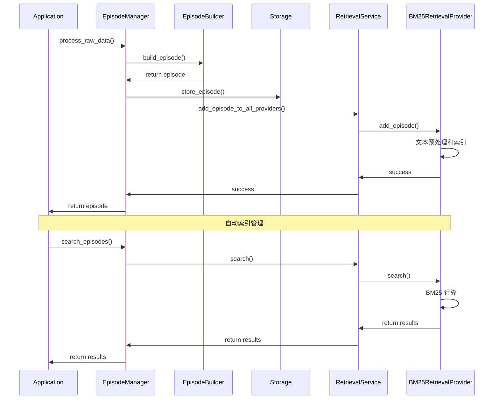

# Nemori 检索层设计与实现

## 概述

基于 Nemori 领域模型的要求，我们设计并实现了一个完整的检索层解决方案，提供高效的情景记忆检索能力。检索层遵循以下核心原则：

1. **检索独立性**：检索逻辑与存储层分离，保持系统架构清晰
2. **策略可插拔**：支持多种检索算法，可根据需求灵活配置
3. **用户隔离性**：确保不同用户数据的完全隔离
4. **性能优化**：提供高效的索引机制和查询优化

## 架构设计

### 分层架构

```
┌─────────────────────────────────────────────┐
│               应用层                         │
│  - EpisodeManager (集成协调)                │
├─────────────────────────────────────────────┤
│               检索服务层                      │
│  - RetrievalService (检索服务)              │
│  - 多策略管理和协调                          │
├─────────────────────────────────────────────┤
│               检索策略层                      │
│  - BM25RetrievalProvider                   │
│  - EmbeddingRetrievalProvider (未来)        │
│  - KeywordRetrievalProvider (未来)          │
│  - HybridRetrievalProvider (未来)           │
├─────────────────────────────────────────────┤
│               检索类型层                      │
│  - RetrievalQuery / RetrievalResult         │
│  - RetrievalConfig / IndexStats             │
│  - RetrievalStrategy 枚举                   │
├─────────────────────────────────────────────┤
│               存储接口层                      │
│  - EpisodicMemoryRepository                │
│  - 存储层数据访问                            │
└─────────────────────────────────────────────┘
```

### 核心组件

#### 1. 检索类型系统

**RetrievalStrategy（检索策略枚举）**
```python
class RetrievalStrategy(Enum):
    BM25 = "bm25"                    # BM25 文本相关性算法
    EMBEDDING = "embedding"          # 语义嵌入相似性
    KEYWORD = "keyword"              # 关键词匹配
    HYBRID = "hybrid"                # 混合策略
```

**RetrievalQuery（检索查询）**
- 统一的查询接口，支持多种检索参数
- 用户隔离和权限控制
- 灵活的过滤条件和排序选项

**RetrievalResult（检索结果）**
- 标准化的结果格式
- 相关性评分和排序
- 分页和统计信息

#### 2. 检索配置 (RetrievalConfig)
- 检索算法特定配置
- 性能参数（索引大小、缓存设置）
- 相关性阈值和权重配置

#### 3. 索引统计 (IndexStats)
- 索引状态和性能指标
- 数据分布统计
- 查询性能分析

## 核心功能

### BM25 检索实现

#### 算法特性
```python
# BM25 算法配置
k1 = 1.2    # 词频饱和参数
b = 0.75    # 文档长度归一化参数
```

#### 文本预处理流程
1. **NLTK 分词**：专业级文本分词处理
2. **停用词过滤**：移除常见停用词提高检索精度
3. **词干提取**：Porter Stemmer 统一词形变化
4. **多字段权重**：
   - 标题权重：3.0
   - 摘要权重：2.0
   - 实体权重：2.0
   - 主题权重：2.0
   - 内容权重：1.0

#### 索引管理
```python
# 添加情景到索引
await provider.add_episode(episode)

# 批量索引更新
await provider.reindex_user_episodes(owner_id, episodes)

# 移除过期索引
await provider.remove_episode(episode_id)
```

### 检索服务功能

#### 多策略管理
```python
# 注册检索策略
service.register_provider(RetrievalStrategy.BM25, config)
service.register_provider(RetrievalStrategy.EMBEDDING, config)

# 动态策略选择
query = RetrievalQuery(
    text="机器学习项目",
    strategy=RetrievalStrategy.BM25,
    owner_id="user123"
)
results = await service.search(query)
```

#### 用户隔离机制
- 每个用户独立的检索索引
- 查询自动限制在用户数据范围内
- 完全的数据隔离保证

#### 生命周期管理
```python
# 服务初始化
await service.initialize()

# 健康状态检查
health = await service.health_check()

# 优雅关闭
await service.close()
```

### 检索查询功能

#### 基础文本检索
```python
query = RetrievalQuery(
    text="Python 编程学习",
    owner_id="user123",
    limit=10
)
results = await service.search(query)
```

#### 高级过滤查询
```python
query = RetrievalQuery(
    text="机器学习",
    owner_id="user123",
    episode_types=[EpisodeType.CONVERSATIONAL],
    time_range_hours=48,
    min_importance=0.5,
    limit=20
)
results = await service.search(query)
```

#### 结果处理
```python
# 检索结果包含
for episode in results.episodes:
    print(f"标题: {episode.title}")
    print(f"相关性: {episode.relevance_score}")
    print(f"内容预览: {episode.content[:100]}...")
```

## 集成架构

### EpisodeManager 集成

#### 自动索引管理
```python
# 创建情景时自动索引
episode = await manager.process_raw_data(raw_data, owner_id="user123")
# ↓ 自动触发
# await retrieval_service.add_episode_to_all_providers(episode)

# 更新情景时自动重索引
await manager.update_episode(episode_id, updated_episode)
# ↓ 自动触发
# await retrieval_service.update_episode_in_all_providers(episode)

# 删除情景时自动清理索引
await manager.delete_episode(episode_id)
# ↓ 自动触发
# await retrieval_service.remove_episode_from_all_providers(episode_id)
```

#### 统一检索接口
```python
# 通过 EpisodeManager 进行检索
results = await manager.search_episodes(
    "机器学习推荐系统",
    owner_id="user123",
    strategy=RetrievalStrategy.BM25,
    limit=15
)
```

#### 索引初始化和重建
```python
# 从现有数据重建索引
await manager.initialize_retrieval_index("user123")

# 获取检索统计信息
stats = await manager.get_retrieval_stats()
```

### 完整数据流



## 性能特性

### BM25 算法优化

#### 索引结构
- **倒排索引**：词项到文档的高效映射
- **词频统计**：TF-IDF 权重计算
- **文档长度归一化**：公平的相关性评分

#### 查询优化
- **增量索引更新**：避免全量重建
- **查询缓存**：热门查询结果缓存
- **批量操作**：提高索引更新效率

### 内存管理
- **按用户分组**：减少内存碎片
- **延迟加载**：按需加载索引数据
- **定期清理**：移除不活跃用户索引

### 相关性评分

#### BM25 评分公式
```
score(q,d) = Σ IDF(qi) × (f(qi,d) × (k1 + 1)) / (f(qi,d) + k1 × (1 - b + b × |d|/avgdl))
```

#### 多字段权重评分
```python
final_score = (
    title_score × 3.0 +
    summary_score × 2.0 +
    entity_score × 2.0 +
    topic_score × 2.0 +
    content_score × 1.0
) / total_weight
```

#### 降级评分机制
- BM25 零分时启用备用评分
- 基于词项匹配计数的简单评分
- 确保相关文档不被遗漏

## 系统监控

### 索引统计
```python
# 获取检索统计
stats = await service.get_all_stats()

# 统计内容包括：
# - 索引文档数量
# - 用户分布
# - 平均查询时间
# - 内存使用情况
```

### 健康检查
```python
# 检查所有检索提供者状态
health = await service.health_check()
# {
#     "bm25": True,
#     "embedding": True,
#     "service_status": "healthy"
# }
```

### 性能监控
- 查询响应时间统计
- 索引更新性能追踪
- 内存使用监控
- 用户活跃度分析

## 扩展性设计

### 新检索策略

#### 语义嵌入检索
```python
class EmbeddingRetrievalProvider(RetrievalProvider):
    async def search(self, query: RetrievalQuery) -> RetrievalResult:
        # 1. 查询文本向量化
        # 2. 余弦相似度计算
        # 3. 相似性阈值过滤
        # 4. 结果排序和返回
        pass
```

#### 混合检索策略
```python
class HybridRetrievalProvider(RetrievalProvider):
    async def search(self, query: RetrievalQuery) -> RetrievalResult:
        # 1. 多策略并行查询
        # 2. 结果合并和去重
        # 3. 加权评分融合
        # 4. 最终排序输出
        pass
```

### 新配置选项
- 检索算法参数调优
- 缓存策略配置
- 性能阈值设置
- 用户个性化配置

### 新统计指标
- 查询模式分析
- 用户行为统计
- 检索质量评估
- 系统负载监控

## 使用示例

### 基础检索流程

```python
# 1. 配置和初始化
config = RetrievalConfig(storage_type="memory")
service = RetrievalService(episode_repo)
service.register_provider(RetrievalStrategy.BM25, config)
await service.initialize()

# 2. 集成到 EpisodeManager
manager = EpisodeManager(
    raw_data_repo=raw_repo,
    episode_repo=episode_repo,
    builder_registry=registry,
    retrieval_service=service
)

# 3. 处理数据（自动索引）
episode = await manager.process_raw_data(raw_data, owner_id="user123")

# 4. 检索查询
results = await manager.search_episodes(
    "机器学习项目讨论",
    owner_id="user123"
)

# 5. 结果处理
for episode in results.episodes:
    print(f"找到相关情景: {episode.title}")
    print(f"相关性评分: {episode.relevance_score:.3f}")
```

### 高级功能使用

```python
# 批量索引重建
await manager.initialize_retrieval_index("user123")

# 多条件查询
results = await manager.search_episodes(
    "Python 编程",
    owner_id="user123",
    episode_types=[EpisodeType.CONVERSATIONAL],
    time_range_hours=72,
    min_importance=0.3,
    limit=25
)

# 系统监控
health = await manager.health_check()
stats = await manager.get_retrieval_stats()
```

## 质量保证

### 检索准确性
- BM25 算法工业级实现
- NLTK 专业文本处理
- 多字段权重优化
- 降级评分保证

### 性能保证
- 增量索引更新
- 高效的数据结构
- 内存使用优化
- 查询响应时间控制

### 可靠性保证
- 完整的错误处理
- 优雅的降级机制
- 自动恢复策略
- 数据一致性保证

## 总结

Nemori 检索层的设计和实现完成了以下目标：

✅ **检索独立性**：与存储层完全分离的检索架构  
✅ **策略可插拔**：支持多种检索算法的灵活配置  
✅ **用户隔离**：完全的用户数据隔离和安全保证  
✅ **BM25 实现**：工业级文本检索算法实现  
✅ **自动集成**：与情景管理的无缝集成  
✅ **性能优化**：高效的索引和查询机制  
✅ **系统监控**：完整的统计和健康检查功能  
✅ **扩展性**：支持未来检索策略的扩展  

该检索层为 Nemori 项目提供了强大的情景记忆检索能力，实现了从原始数据到可搜索情景记忆的完整数据流，为用户提供高效准确的记忆检索体验。