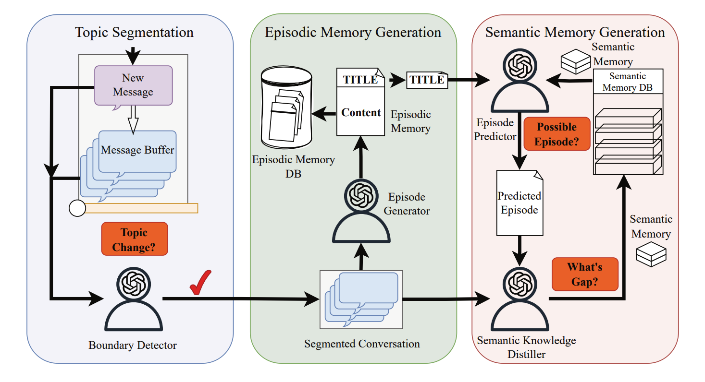
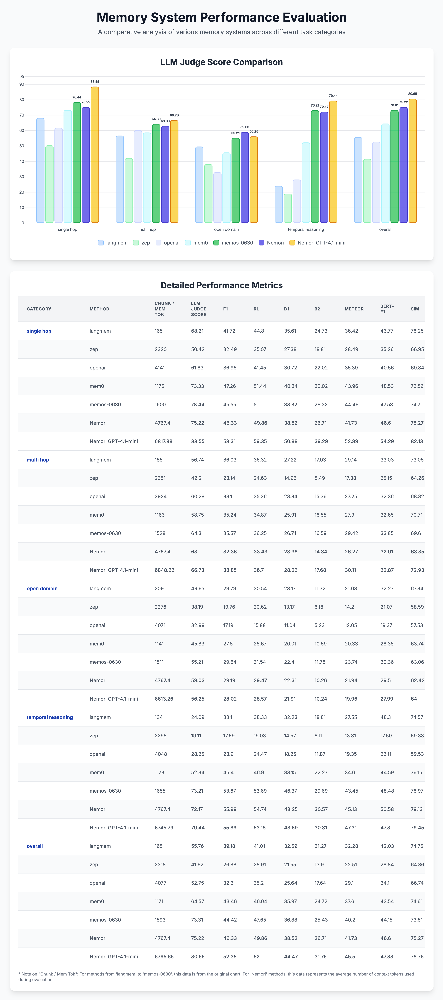

# 🧠 Nemori Memory System

Nemori is a self-organising long-term memory substrate for agentic LLM workflows. It ingests multi-turn conversations, segments them into topic-consistent episodes, distils durable semantic knowledge, and exposes a unified search surface for downstream reasoning. The implementation combines insights from Event Segmentation Theory and Predictive Processing with production-ready concurrency, caching, and pluggable storage.

- **🐍 Language:** Python 3.9+
- **📜 License:** MIT
- **📦 Key dependencies:** OpenAI API, ChromaDB, uv (optional package manager)

---

## 1. ❓ Why Nemori

Large language models rapidly forget long-horizon context. Nemori counters this with two coupled control loops:

1. **🔄 Two-Step Alignment**
   - *🎯 Boundary Alignment* – LLM-powered boundary detection with transitional masking heuristics keeps episodes semantically coherent.
   - *📝 Representation Alignment* – the episode generator converts each segment into rich narratives with precise temporal anchors and provenance.
2. **🔮 Predict–Calibrate Learning**
   - *💭 Predict* – hypothesise new episodes from existing semantic knowledge to surface gaps early.
   - *🎯 Calibrate* – extract high-value facts from discrepancies and fold them into the semantic knowledge base.

The result is a compact, queryable memory fabric that stays faithful to the source dialogue while remaining efficient to traverse.

---

## 2. 🚀 Quick Start

### 2.1 📥 Install and bootstrap

Using [uv](https://github.com/astral-sh/uv) is the easiest way to manage the environment:

```bash
brew install uv                # or curl -LsSf https://astral.sh/uv/install.sh | sh

git clone https://github.com/anonymous/nemori-code.git
cd nemori-code

uv venv
source .venv/bin/activate      # Windows: .venv\Scripts\activate

uv pip install -e .
uv pip install -e ".[dev,evaluation]"

# Install spaCy language packs used for BM25 tokenization
python -m spacy download en_core_web_sm
python -m spacy download zh_core_web_sm
```

### 2.2 🔑 Credentials

Create a `.env` file in the repo root:

```ini
OPENAI_API_KEY=sk-...
```

Nemori only reads these variables; it never writes secrets to disk. 🔒

### 2.3 💡 Minimal usage

```python
from nemori import NemoriMemory, MemoryConfig

config = MemoryConfig(
    llm_model="gpt-4o-mini",
    enable_semantic_memory=True,
    enable_prediction_correction=True,
)

memory = NemoriMemory(config=config)

memory.add_messages(
    user_id="user123",
    messages=[
        {"role": "user", "content": "I started training for a marathon in Seattle."},
        {"role": "assistant", "content": "Great! When is the race?"},
        {"role": "user", "content": "It is in October."},
    ],
)
memory.flush(user_id)
memory.wait_for_semantic(user_id)

results = memory.search(user_id, "race", search_method="vector")
print("Search results:", results)

memory.close()
```

---

## 3. 🏗️ System Architecture



---

## 4. 📂 Repository Layout

```
src/
├── api/                 # Facade entry points
├── core/                # Orchestration, buffers, metrics
├── generation/          # Episode & semantic generation, prediction loop
├── models/              # Dataclasses for messages and memories
├── search/              # BM25, vector, hybrid, original text search
├── storage/             # JSONL storage backends
├── utils/               # LLM client, embeddings, caching utilities
└── ...

evaluation/
├── locomo/              # LoCoMo benchmark scripts
├── longmemeval/         # Long-context evaluation suite
└── readme.md            # Dataset instructions

memories/                # Default persistence root (episodes/, semantic/)
```

---

## 5. 📊 Running Evaluations

### 5.1 🔧 LoCoMo pipeline

```bash
cd evaluation
python locomo/add.py
python locomo/search.py
python locomo/evals.py
python locomo/generate_scores.py
```

### 5.2 🏆 Latest LoCoMo scores

| Category | BLEU | F1 | LLM | Count |
|----------|------|----|-----|-------|
| Multi-Hop | 0.3426 | 0.4312 | 0.7730 | 282 |
| Temporal-Reasoning | 0.5050 | 0.5874 | 0.7632 | 321 |
| Open-Domain | 0.2294 | 0.2878 | 0.5521 | 96 |
| Single-Hop | 0.4878 | 0.5497 | 0.8716 | 841 |

✨ Overall means: BLEU **0.4487**, F1 **0.5196**, LLM alignment **0.8110**, with only **3K** context tokens. 


### 5.3 📈 Old MVP LoCoMo scores:



### 5.3 📚 LongMemEval

See `evaluation/longmemeval/readme.md` for running the 100k-token context benchmark.

---

## 6. 🛠️ Developing with Nemori

- 🧪 Tests: `pytest`
- 🔍 Linting: `ruff check src`
- 📝 Type checking: `mypy src`
- 📊 Benchmark helpers live in `scripts/`

Use the `NemoriMemory` facade for experiments and inject custom storage or LLM clients when integrating into larger systems.

---

## 7. 🔧 Troubleshooting

| 🚨 Symptom | 🔍 Likely cause | 💡 Mitigation |
|---------|--------------|------------|
| High latency on first query | Chroma cold start | Preload collections via `load_user_data_and_indices_for_method` |

---

## 8. 🤝 Contributing

1. 🍴 Fork the repository and create a feature branch.
2. ✅ Add or update tests (`pytest`, `ruff`, `mypy`).
3. 🚀 Open a PR explaining architectural impact (boundary logic, storage schema, etc.).

Nemori is evolving toward multi-agent deployments. Feedback and collaboration are welcome! 💬

---
## 9. 📰 News

- **🎉 2025-09-26** — Released Nemori as fully open source, covering episodic and semantic memory implementations end-to-end.
- **🏁 2025-07-10** — Delivered the MVP of episodic memory generation.
